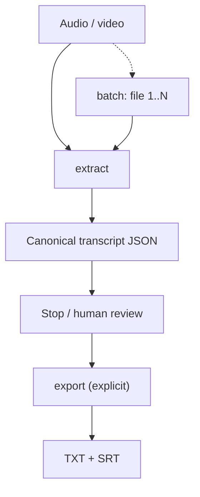
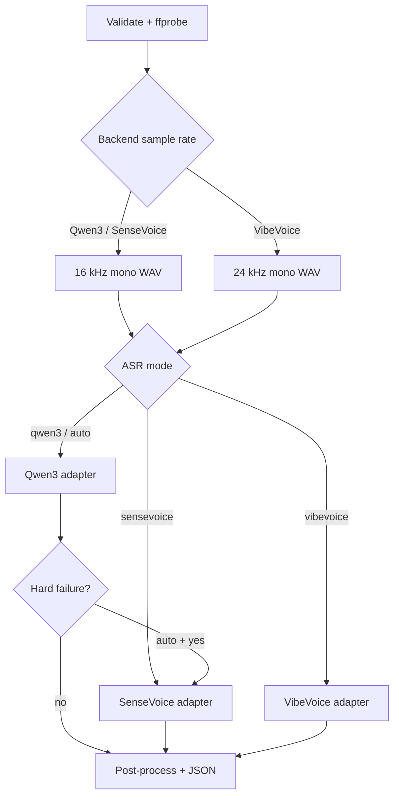
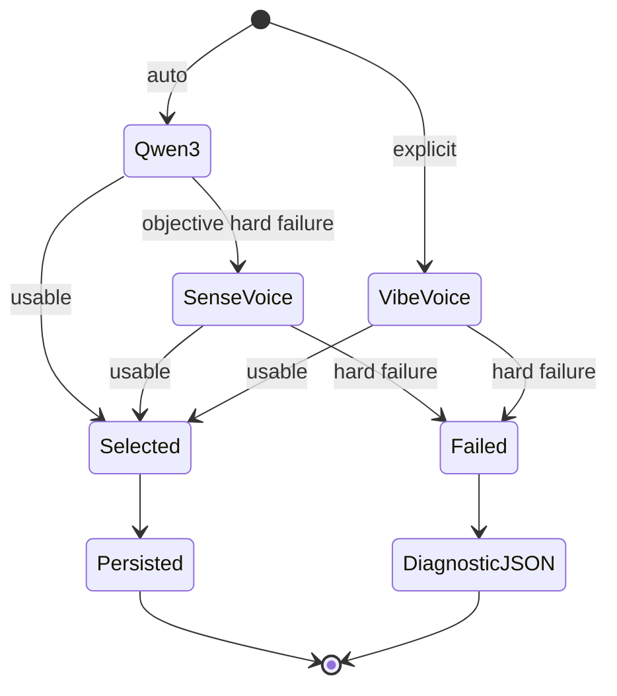

# Meeting Recording Processor — Architecture

**版本：** 0.1.0  
**狀態：** Phase 1 implementation architecture

## 1. System boundary

Project 有兩個本機、互不自動串連嘅 application flows；`batch` 只係逐一重用 `extract`：



外部 AI cleanup、meeting notes 或 action items 唔係本 system component。影片 frame、cloud API 同外部 speaker identity 都不會進入 data flow；VibeVoice 原生 speaker id 只作 attempt metadata。

## 2. Extract data flow



Routing state：



指定 `qwen3`、`sensevoice` 或 `vibevoice` 時只有一個 attempt。`auto` 都只會有最多兩個，而且永遠唔會進入 VibeVoice；pipeline 唔做 ensemble 或 subjective quality ranking。

## 3. Module map

| Module | Responsibility | Boundary |
|---|---|---|
| `cli.py` | argparse、user messages、batch routing、exit codes | 不載入 model |
| `config.py` | modes、paths、defaults、supported extensions | 不做 I/O pipeline |
| `runtime.py` | Darwin/arm64、commands、HF offline env | 不做 inference |
| `media/probe.py` | ffprobe JSON、audio stream selection | 不 decode transcript |
| `media/normalize.py` | ffmpeg stream map、backend-specific PCM WAV | 不改 input |
| `media/signal.py` | duration/RMS/active-audio stats | 不評主觀準確度 |
| `models.py` | explicit download、offline snapshot resolve | extract 不連網 |
| `asr/qwen3.py` | Qwen result → `BackendResult` | 不決定 fallback |
| `asr/sensevoice.py` | WAV chunks → `BackendResult` | 不偽造 word timestamp |
| `asr/vibevoice.py` | local 24 kHz WAV → native Transformers `BackendResult` | 不改 canonical speaker schema、不 fallback |
| `progress.py` | backend-neutral events、TTY/plain renderers、elapsed/percentage helpers | 不執行 ASR |
| `quality.py` | objective hard-failure metrics | 不做內容評分 |
| `postprocess.py` | NFC、whitespace、s2hk、cue grouping | 不翻譯／摘要／改寫 |
| `pipeline.py` | lifecycle、routing、attempt preservation | 不輸出 TXT/SRT |
| `schema_io.py` | validation、atomic JSON/text writes | 不做 ASR |
| `outputs/writers.py` | completed JSON → TXT/SRT | 拒絕 failed JSON |
| `diagnostics.py` | platform/package/model availability report | 不修復或下載 |

## 4. Backend contract

Adapters 實作：

```python
class AsrBackend(Protocol):
    name: str
    model_id: str

    def transcribe(
        self,
        audio_path: Path,
        *,
        language: str,
        profile_text: str | None,
        progress_callback: Callable[[ProgressEvent], None] | None = None,
    ) -> BackendResult: ...
```

`BackendResult` 包含 backend/model/language、raw text、零至多個 segments、metadata 同 warnings。Pipeline 只識 canonical dataclass，唔依賴 upstream library result type。

### Qwen3

- lazy import `mlx_qwen3_asr.transcribe`；
- 使用 local snapshot path、`return_timestamps=True`、`return_chunks=True`；
- 使用 pinned runtime 嘅 structured `on_progress` callback，將 processed audio seconds／total duration 轉成 generic progress events；
- 優先讀 model segments，冇先讀 chunks；
- 保存 finish reason、truncation 同 timestamp provenance。

### SenseVoice

- lazy import `mlx_audio.stt.load`，直接載入 local snapshot path；
- normalized WAV 以 30 秒分段，逐段 `generate(..., language="yue", use_itn=False)`；
- 逐個完成 chunk 以實際 audio seconds 報告 progress；
- 保存 chunk start/end、language/emotion/event（如 runtime 有提供）；
- 原生冇 word timestamp，postprocessor 對每個 chunk 做 weighted cue estimation。

### VibeVoice

- 使用 pinned `transformers>=5.3.0,<5.4.0` native `AutoProcessor` 同 `VibeVoiceAsrForConditionalGeneration`；
- extract 只傳入 model resolver 回傳嘅 local snapshot，並以 `local_files_only=True` 建立 processor/model；
- 要求可用 Apple Silicon MPS；模型使用 checkpoint/config 提供嘅 dtype，唔會隱藏 fallback 到 CPU；
- `apply_transcription_request(audio=local_wav, prompt=profile_text or None)` 對應 context hint；
- `decode(..., return_format="transcription_only")` 供 quality gate，`return_format="parsed"` 嘅有效 Start/End/Content 轉成 model-timed segments；
- speaker id、raw decoded output 同 device/dtype/runtime provenance 保留喺 attempt metadata；canonical schema 暫不加入 speaker。

## 5. Quality gate

Quality gate 只使用可重現 signals：

| Signal | Rule | `auto` action |
|---|---|---|
| backend error | exception | fallback |
| empty output | non-whitespace = 0 | fallback |
| punctuation collapse | Unicode P/S ratio > 0.90 | fallback |
| near-zero speech text | active audio >= 10s 且 L/N < 3 | fallback |
| term/accuracy concern | 無可靠 objective rule | accept；人手可另行 retry |

每個 signal 嘅 measured values 同 reasons 都嵌入 attempt。第一次失敗 attempt 係 immutable evidence；selected attempt 只靠 `selected_attempt_id` 指向。

## 6. Canonical package and timing provenance

JSON 係 extract 唯一 output、亦係 export 唯一 input。主要區域：

| Field | Content |
|---|---|
| `source` | absolute path、name、size、SHA-256、media/signal metadata |
| `request` | mode、language、context/hash、models、`offline: true` |
| `attempts` | raw text/segments、quality、errors、runtime、snapshot |
| `selected_attempt_id` | 成功 attempt pointer；failed 時為 null |
| `transcript` | Traditional canonical text/segments；failed 時為 null |
| `processing` | deterministic transforms、optional retained work path |
| `tool` | Python/package/platform/ffprobe provenance |

Segment `timing_source`：

- `model`：原生 model timestamp；
- `estimated_from_chunk`：有 chunk boundaries，cue 位置按字元權重估算；
- `estimated_from_duration`：只有總 duration，整份文字按字元權重估算。

Progress event phases：

```text
preparing → loading-model → transcribing
                              ├─ success → writing-output → completed
                              └─ objective hard failure + auto fallback
                                   → fallback → transcribing → ...
```

TTY renderer 更新單行；redirect／CI 使用 thresholded plain log lines。`current/total` 只在 backend 提供可靠 audio timestamp、duration 或 chunk count 時標為 determinate。

`fallback` 同 `transcribing` 共用 lifecycle rank，令 `transcribing → fallback → transcribing` 合法；`writing-output` 之後嘅 backward transition 仍然會被拒絕。Fallback event 只顯示 transition/model loading，唔帶 transcription percentage；下一個 backend 嘅 percentage state 重新由自己嘅 0% 計。

Renderer 係 observability side channel：stream 或 backend progress callback 出錯時會停用後續 progress，但唔會將 extraction 轉成 backend error。Reporter 以 atomic current-event 更新 heartbeat，並拒絕 delayed/regressive phase，避免 fallback 或 stale heartbeat 將畫面倒退。

## 7. Filesystem and safety

```text
input (read-only)
  ├─ work/<stem>-<run-id>/audio-<backend-rate>-mono.wav   # default cleanup
  └─ output/<stem>.transcript.json             # atomic write
        ├─ output/<stem>.txt                    # explicit export
        └─ output/<stem>.srt                    # explicit export
```

- work directory 使用 run-specific name，cleanup 只針對該 directory；
- `--keep-work-files` 先保存 WAV；
- default collision policy 係 fail；
- `batch` 會喺第一個 extraction 前 preflight 全部 stem-based destinations，並以 case-insensitive key 拒絕 intra-batch collision；`--overwrite` 唔會繞過呢個 preflight；
- temp file同 final output 位於同一 parent，以 `os.replace` 原子提交；
- JSON 保存 raw attempt，所以 canonical s2hk conversion 不會破壞原始證據。

## 8. Offline model lifecycle

`download-model` 係唯一 network-aware path：Hugging Face cache environment 設為 online 並下載 snapshot。`extract` 每次都重新設成 offline，加 `local_files_only=True` resolve；cache miss 轉成 domain error，絕不傳 media 到 remote service。VibeVoice 嘅 native processor/model 亦只接受 local snapshot path，唔會喺 extract 以 model id 觸發 remote fetch。

## 9. Verification strategy

Backend-independent suite 注入 fake platform/probe/normalizer/signal/model/backend，驗證：

- no-fallback success、punctuation fallback、backend exception fallback；
- subjective-but-substantive output 不 fallback；
- explicit Qwen mode 不 fallback；
- failed diagnostic JSON、attempt preservation、collision policy；
- media command construction、signal analysis、text conversion/cue timing；
- progress event math、TTY/plain/off rendering、fail-open stream/callback isolation、monotonic lifecycle/heartbeat ordering、backend failure cleanup、unknown duration tolerance、batch file index/collision preflight；
- completed/failed schema、TXT/SRT output、CLI defaults。
- VibeVoice model-free adapter mapping、MPS/offline guard、24 kHz normalization、duration limit、indeterminate progress 同 explicit-only routing。

支援平台上另需 integration smoke tests：三個 model family load、六種 input containers、影片 audio-only selection、offline cache miss/hit、VibeVoice 60 分鐘 limit 同實際 SRT sync。

## 10. Traceability

`scripts/transcribe-qwen3-baseline.sh` 同 legacy batch variant 保留早期 Qwen CLI command line，方便比較 adapter output。Baseline 支援範圍唔等於 canonical v1 contract；正式功能以 `mrp extract`／`mrp batch`／`mrp export`、本 spec 同 JSON Schema 為準。
